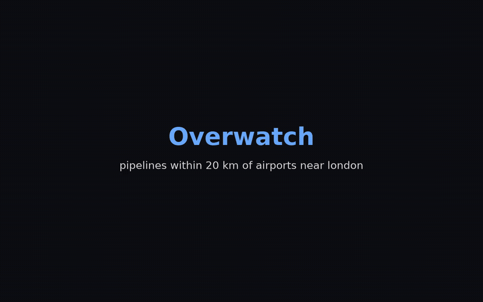
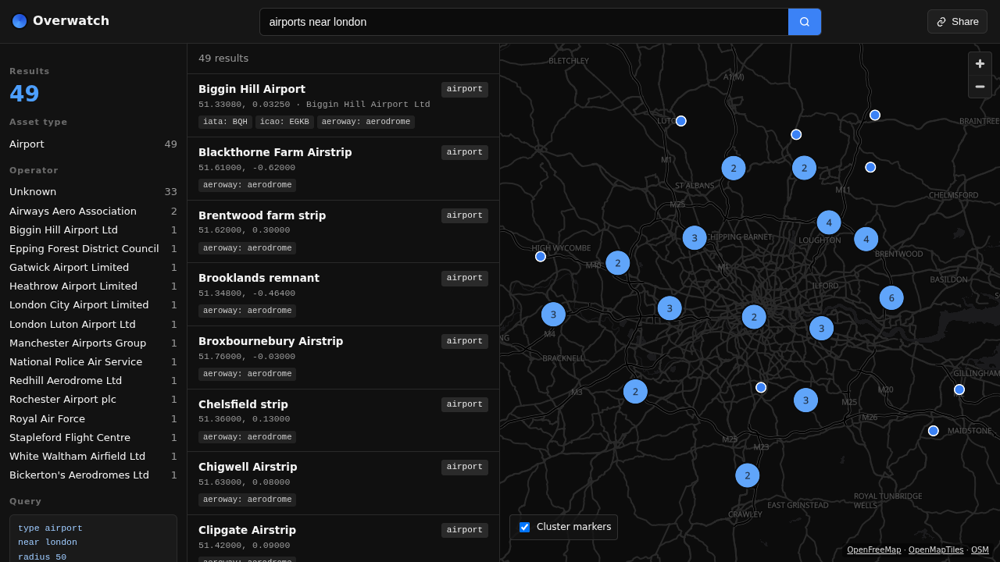
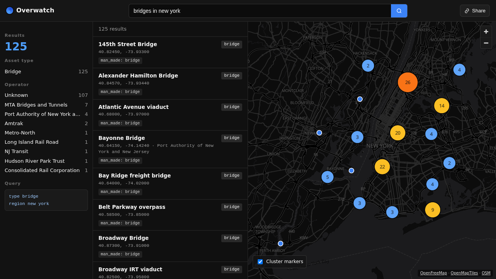
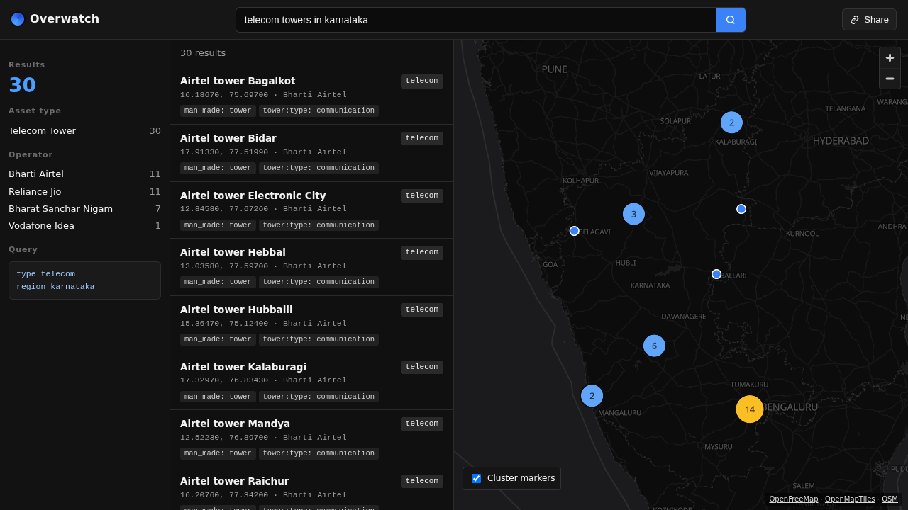
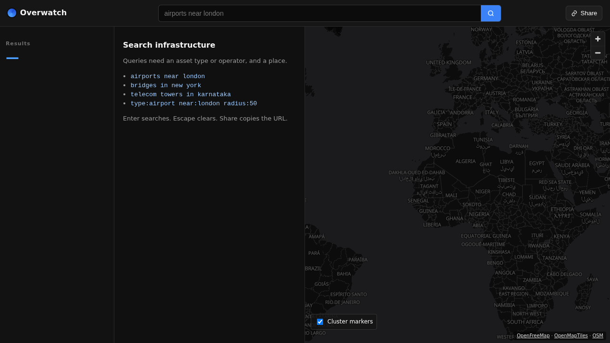
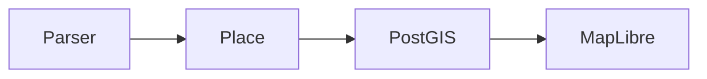

# Overwatch

Search physical infrastructure the way you would say it out loud — including spatial joins.

`pipelines within 20 km of airports near london` · `airports near london` · `bridges in new york`

Overwatch is a geospatial search app. You type a place and an asset type (or a join hop). PostGIS answers with the stored geometry (point, line, or polygon). MapLibre draws those shapes on a dark OpenFreeMap vector basemap and clusters centroids at low zoom. There is no Overpass round trip, no Nominatim in the search path, and no Leaflet.

[](https://overwatch-ochre.vercel.app/showcase.mp4)

Live at [overwatch-ochre.vercel.app](https://overwatch-ochre.vercel.app). The cut above is the join demo (`pipelines within 20 km of airports near london`); also at [`/showcase.mp4`](https://overwatch-ochre.vercel.app/showcase.mp4).



## Showcase join

After a densify (`npm run db:densify` for Greater London, or `npm run db:densify -- new-york` for the bridges gallery), the headline London query is a spatial join:

| Query | What you should see |
| --- | --- |
| `pipelines within 20 km of airports near london` | Pipeline subjects plus related airports inside 20 km, near London |

Seed alone is thin for joins. Densify once locally (or against Neon via `DATABASE_URL`) so the gallery is not empty.

The older seed spot-checks still hold:

| Query | Hits | Notable |
| --- | ---: | --- |
| `airports near london` | 49 | Heathrow is in the set |
| `bridges in new york` | 125 | Brooklyn Bridge is in the set |
| `telecom towers in karnataka` | 30 | Airtel, Jio, BSNL, Vodafone Idea |

Counts came from `curl` against a running local app. `near` uses a 50 km radius unless you override it.

## What you get

A natural-language parser and a structured `key:value` parser that both land on the same query object. SQL then runs meter ST_DWithin / ST_Intersects against mixed `geometry(Geometry, 4326)` with GIST indexes. The UI is a dark three-column layout: facets, result cards, map.

The URL is the query. Enter rewrites NL into stable structured tokens (`type:pipeline near:london within:airport:20`), so Share copies a round-trippable link. Escape clears.

## Gallery







## How a search runs



You type `q`. The parser emits a query object. Overwatch resolves the place from the `places` table, then PostGIS filters `assets` with `ST_DWithin` on `geom::geography` (`near`) or `ST_Intersects` on the real geom (`in` / `region` / `country`). Join hops (`within N km of <type>`) chain related asset sets. The API returns GeoJSON of the stored geometry plus facets. MapLibre draws points, lines, and polygons, and clusters on the generated centroid.

`near` uses the place point and your radius in meters. `in` uses the place bbox. The old prototype hit public Overpass and timed out. This classifies assets at ingest and queries local PostGIS.

## Run it

You need Node 22.12+ and Docker Compose (or any PostGIS reachable via `DATABASE_URL`).

```bash
docker compose up -d postgres
npm run db:migrate
npm run db:seed
cp .env.example .env
npm install
npm test
npm run dev
```

Open [http://localhost:3000](http://localhost:3000). Postgres listens on `127.0.0.1:5432`. User, password, and database are all `overwatch`.

`docker compose` applies `db/schema.sql` on first start. `npm run db:seed` loads demo places and mixed-geometry assets.

Production:

```bash
npm run build && npm start
```

## Query language

Natural language:

```
airports near london
aerodromes near london
bridges in new york
telecom towers in karnataka
pipelines near london
power lines near london
substations in karnataka
airports near london within 20 km
airtel in karnataka
pipelines within 20 km of airports near london
National Grid within 10 km of substations near london
```

Structured tokens. Unquoted `operator` / `near` / `region` / `country` values may include spaces until the next `key:`; quote when you prefer.

```
type:airport near:london radius:50
type:pipelines near:london
type:power_line near:london
type:datacenter region:california
operator:airtel region:karnataka
operator:"Long Island Rail Road" region:"new york"
type:pipeline near:london within:airport:20
operator:National Grid within:substation:10 near london
```

| Token | Meaning |
| --- | --- |
| `type` | Canonical asset type or an alias from the catalog (`airport` / `aerodrome`, `pipelines` → `pipeline`, `power lines` → `power_line`, `datacenter` → `data_center`) |
| `operator` | Substring match on `assets.operator`, case-insensitive. `%` and `_` are literals, not wildcards |
| `region` / `country` | Place name. `country` prefers a country row when resolving |
| `near` | Place name plus radius search |
| `radius` | Kilometers, 1-500. Default 50. Used only with `near` |
| `within` | Join hop as `within:<type>:<km>` (e.g. `within:airport:20`). Same `JoinHop` as NL; km clamped 1-500 |

`within N km of <type>` (NL) and `within:<type>:<km>` (structured) are spatial join hops (up to 3 combined; structured tokens first). The place filter applies only to the innermost type. Unknown types are not hops. `within 20 km of london` remains place-radius, not a hop. Operator filters combine with joins: subject rows match the operator; hop assets stay spatial (e.g. `operator:National Grid within:substation:10 near london`).

You need a type or an operator, and you need a place. Missing type/operator or missing place returns `invalid_query` with a specific message; an unrecognized `type:` token is called out as unknown. A place missing from the places table returns `unknown_place`.

Demo places: London, New York, Karnataka, Mumbai, France, California, Germany, India, Berlin, and Texas. Aliases such as nyc and bombay resolve too. scripts/load-gazetteer.sh loads Natural Earth countries, admin-1, and populated places.

## HTTP API

```bash
curl -s "http://localhost:3000/api/search?q=airports+near+london"
```

| Status | When |
| ---: | --- |
| 200 | Hits, including `stats.total === 0` |
| 400 | `invalid_query` (no type/operator, no place, or `q` longer than 500 chars) |
| 404 | `unknown_place` |

A hit looks like this. Heathrow is in the London set.

```json
{
  "results": [
    {
      "id": "node/9000000001",
      "osmType": "node",
      "osmId": 9000000001,
      "name": "Heathrow Airport",
      "type": "airport",
      "operator": "Heathrow Airport Limited",
      "lat": 51.47,
      "lon": -0.4543,
      "tags": {
        "iata": "LHR",
        "icao": "EGLL",
        "aeroway": "aerodrome",
        "wikipedia": "en:Heathrow Airport"
      }
    }
  ],
  "stats": {
    "total": 49,
    "types": { "airport": 49 },
    "operators": { "Heathrow Airport Limited": 1 }
  },
  "bounds": [-0.51, 51.28, 0.33, 51.69],
  "query": {
    "type": "airport",
    "operator": null,
    "region": null,
    "country": null,
    "near": "london",
    "radius": 50,
    "raw": "airports near london"
  },
  "place": {
    "name": "London",
    "kind": "city",
    "lat": 51.5074,
    "lon": -0.1278
  }
}
```

`results` is capped at 500 rows. `stats.total` is the unclipped count.

## Data model

Two tables, both in EPSG 4326.

**places**

| Column | Type |
| --- | --- |
| `name` | text, unique on `lower(name)` |
| `aliases` | text[] |
| `kind` | `city` / `region` / `country` |
| `geom` | `geography(Point, 4326)`, GIST |
| `bbox` | `geometry(Polygon, 4326)`, GIST |

**assets**

| Column | Type |
| --- | --- |
| `osm_type`, `osm_id` | unique pair (`node` / `way` / `relation` + bigint) |
| `name` | text |
| `canonical_type` | text, btree; also composite GiST with `geom::geography` for join hops |
| `operator` | text, btree |
| `geom` | `geometry(Geometry, 4326)`, source of truth, GIST |
| `centroid` | generated `geography(Point, 4326)` for pins / clusters |
| `bbox` | generated `geometry(Polygon, 4326)` for index / display |
| `tags` | jsonb |

Nested join hops (`ST_DWithin` + `canonical_type` in `EXISTS`) use `assets_type_geom_geog_gix` so Postgres can apply type and geography in one GiST Index Cond. Apply with `npm run db:migrate` (or `./scripts/apply-sql.sh db/migrate_join_search_perf.sql` on an already-migrated DB).


Type ids, aliases, and OSM matchers live in [`src/domain/catalog.ts`](src/domain/catalog.ts). Ingest classifies a feature once. Search never re-reads raw OSM tags.

## Densify a region

The seed is a demo. To make joins and gallery queries dense, fetch a documented Geofabrik extract and import it through the **same** import path. Scripts never fetch the planet; `import-pbf.sh` never downloads.

Documented extracts (see `scripts/regions.sh`):

| Region id | Geofabrik path | Gallery / join target |
| --- | --- | --- |
| `greater-london` (default) | `europe/united-kingdom/england/greater-london` | London joins (`pipelines within 20 km of airports near london`) |
| `new-york` | `north-america/us/new-york` (US state; aliases: `nyc`, `new-york-city`) | `bridges in new york` |

```bash
# Local Docker / default DATABASE_URL
npm run db:up          # if needed
npm run db:migrate
npm run db:densify                 # Greater London (default)
npm run db:densify -- new-york     # second region — densifies bridges gallery
# or: REGION=new-york npm run db:densify
```

Or step by step:

```bash
npm run db:fetch-region                  # caches data/greater-london-latest.osm.pbf
npm run db:fetch-region -- new-york      # caches data/new-york-latest.osm.pbf
npm run db:import-pbf                    # defaults to Greater London path
npm run db:import-pbf -- new-york        # same import path, New York PBF
# or: REGION=new-york npm run db:import-pbf
# or: ./scripts/import-pbf.sh /path/to/other-region.osm.pbf
```

Needs [osmium-tool](https://osmcode.org/osmium-tool/). Filter tags cover every classify type in `scripts/load-geojson.py` (aeroway, man_made, power, industrial, landuse=industrial, landuse=port, building=data_centre, communication:mobile_phone, communication:radio, bridge, route=pipeline, telecom). Export keeps points, linestrings, and polygons (no centroid-on-import). The loader skips non-finite coordinates and anything outside WGS84 bounds. Classify maps edge OSM tags (power line/cable/minor_line, bridge=*, telecom mast/cellular/radio, route=pipeline, telecom=exchange) onto existing catalog ids only — see `tests/classify_test.py`. PBFs stay under `data/` and are gitignored — never commit them.

Against Neon (or any remote PostGIS):

```bash
# Prefer dotenv-style env (never commit). sslmode=require on the URL, or set PGSSLMODE=require.
set -a; source /path/to/neon.env; set +a
# apply-sql.sh / load-geojson.py prefer DATABASE_URL or libpq PG* over a local
# Docker container, and keep passwords off the psql argv when PGHOST/PGUSER/PGDATABASE are set.
npm run db:migrate     # idempotent migrate_geom
npm run db:densify     # fetch Greater London PBF (cached under data/) then import
npm run db:densify -- new-york   # second region (New York) via the same path
```

Verified on Neon (prod) with Greater London densify — order of magnitude only (exact
counts drift as OSM updates):

- ~10³–10⁴ assets total after one London densify (low–mid thousands)
- Dominant types: `substation` (thousands), `industrial` / `bridge` (thousands),
  `pipeline` / `telecom` (hundreds), `airport` / `power_plant` / `helipad` (tens)
- Re-running densify is idempotent (`ON CONFLICT (osm_type, osm_id) DO UPDATE`);
  counts stay flat when the extract has not changed
- Loader upserts in batches of 500 with quiet psql (`-q`) so remote RTT does not
  print one `INSERT 0 1` line per row

Prove a join after import (API or SQL). Headline query should return non-trivial
subject + related — typically dozens of airports near London and hundreds of
pipelines within 20 km:

```bash
curl -sG 'http://localhost:3000/api/search' --data-urlencode 'q=pipelines within 20 km of airports near london' | jq '.stats, (.related|length), (.results|length)'
curl -sG 'http://localhost:3000/api/search' --data-urlencode 'q=bridges in new york' | jq '.stats.total'
```

## Load a real extract

Short form when you already have a PBF (still the one import path):

```bash
./scripts/import-pbf.sh /path/to/region-latest.osm.pbf
```

Do not fetch the planet in CI. Do not commit `data/*.osm.pbf`.

## Tests

Vitest runs parser unit tests and PostGIS search tests against the seed. Parser coverage includes natural language, structured tokens, quoted values, radius clamps, and operator word boundaries. Search tests check the three demo queries, non-point geometries, Berlin and Texas fixtures, `unknown_place`, `invalid_query`, operator LIKE escaping, and the 500-row cap. Classify fixtures cover `load-geojson.py` RULES without requiring osmium.

## Keyboard

| Key | Action |
| --- | --- |
| Enter | Submit the search. The URL `q` param is the source of truth |
| Escape | Clear the input and the query |
| Share | Copy the current URL to the clipboard |

## Stack

| Piece | Role |
| --- | --- |
| TanStack Start | Vite, React 19, Router, Query |
| Postgres 16 + PostGIS | Places, assets, GIST filters |
| MapLibre GL JS | OpenFreeMap vector basemap, GeoJSON clusters |
| postgres.js | Parameterized SQL only |
| Vitest | Parser and search tests |

## Map attribution

Basemap: OpenFreeMap / OpenMapTiles / OSM. Vector style from OpenFreeMap (https://openfreemap.org) and OpenMapTiles (https://www.openmaptiles.org). Data (c) OpenStreetMap contributors (https://www.openstreetmap.org/copyright).
